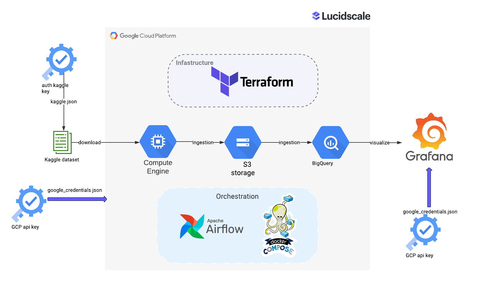
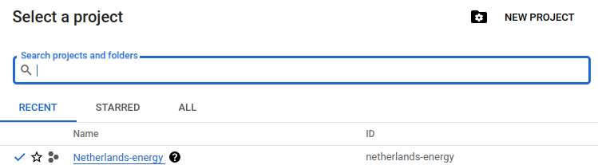
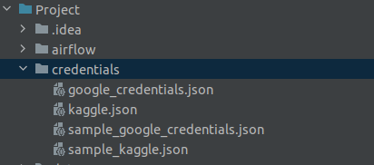
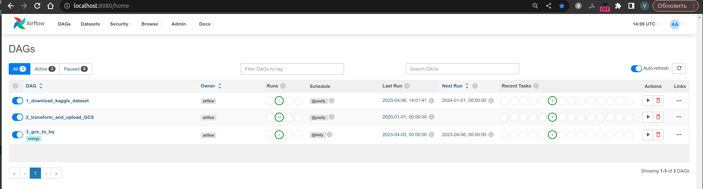
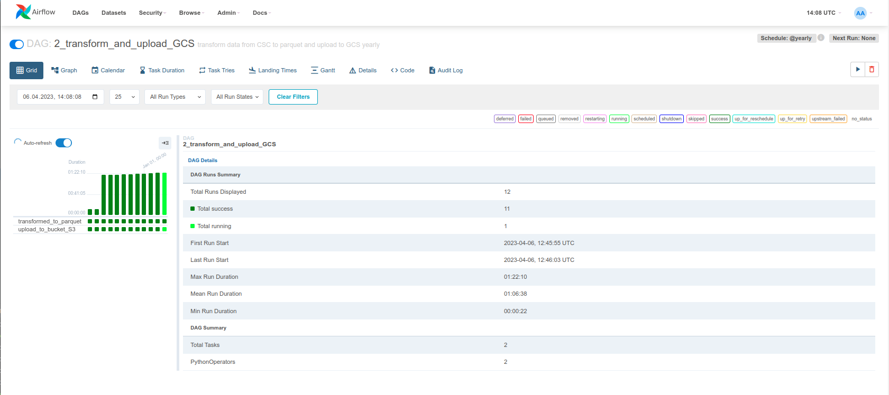
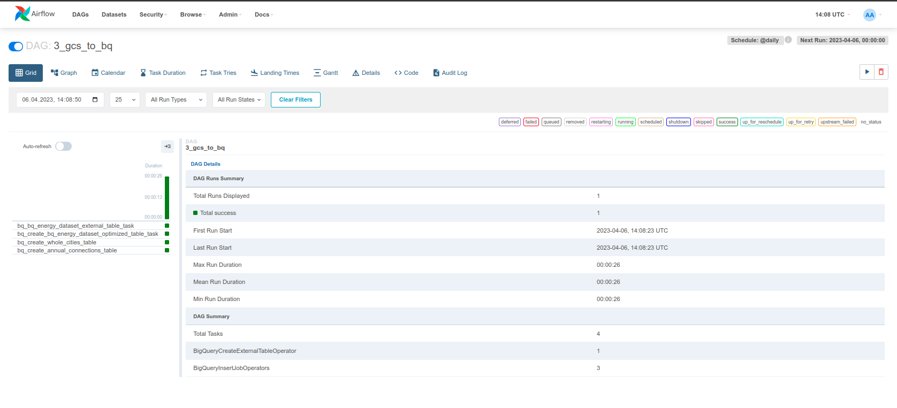
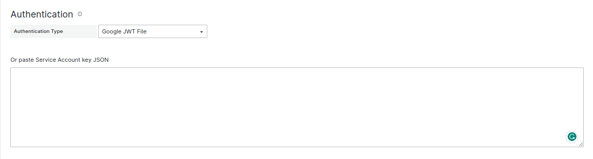
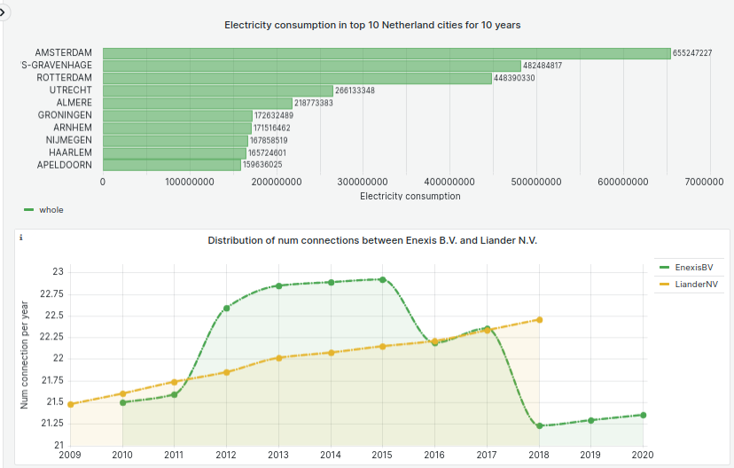
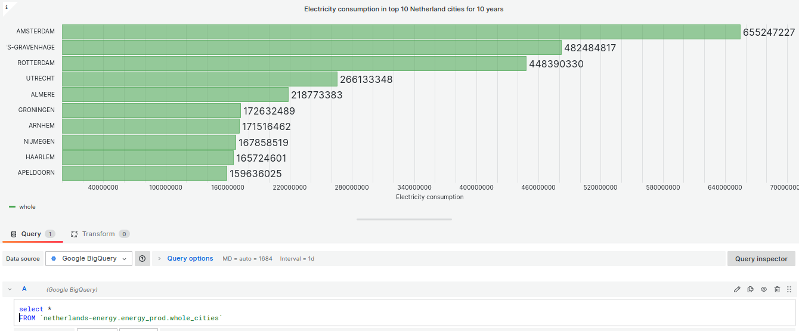
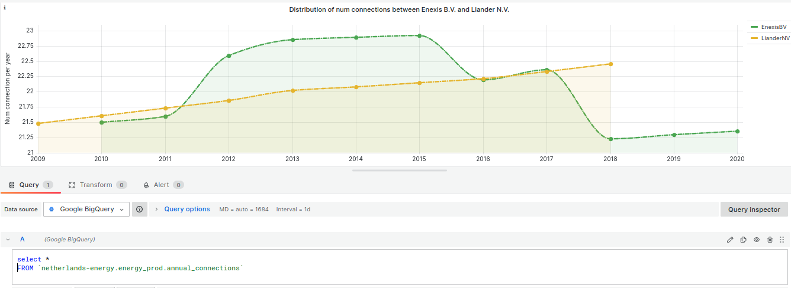

# Course Project - Netherlands energy market analysis 

## Overview
This project was executed as a part of the [Data Engineering Zoomcamp](https://github.com/DataTalksClub/data-engineering-zoomcamp) 
course held by [DataTalks.Club](https://datatalks.club/). The goal of this project is to apply everything we learned
in this course and build an end-to-end data pipeline.

## Problem description
Electrical energy is caused by moving electric charges called electrons. The faster the charges move, the more electrical energy they carry.
As the charges that cause the energy are moving, electrical energy is a form of kinetic energy.
Lightning, batteries and even electric eels are examples of electrical energy in action!

The key goals of the project are:
* develop a data pipeline that will help to organize data processing in a batch manner (on a yearly basis);
* build analytical dashboard that will make it easy to discern the trends and digest the insights.

The period of the data processing will cover from 2009 to 2020.

## Dataset
The columns in each file are:

- **net_manager**: code of the regional network manager
- **purchase_area**: code of the area where the energy is purchased
- **street**: Name of the street
- **zipcode_from and zipcode_to**: 2 columns for the range of zipcodes covered, 4 numbers and 2 letters
- **city**: Name of the city
- **num_connections**: Number of connections in the range of zipcodes
- **delivery_perc**: percentage of the net consumption of electricity or gas. The lower, the more energy was given back to the grid (for example if you have solar panels)
- **perc_of_active_connections**: Percentage of active connections in the zipcode range
- **type_of_connection**: principal type of connection in the zipcode range. For electricity is # fuses X # ampère. For gas is G4, G6, G10, G16, G25
- **type_conn_perc**: percentage of presence of the principal type of connection in the zipcode range
- **annual_consume**: Annual consume. Kwh for electricity, m3 for gas
- **annual_consume_lowtarif_perc**: Percentage of consume during the low tarif hours. From 10 p.m. to 7 a.m. and during weekends.
- **smartmeter_perc**: percentage of smartmeters in the zipcode ranges

## Technologies
I am going to use the following technologies for this project:

* Cloud: GCP
    * Data Lake (DL): GCS
    * Data Warehouse (DWH): BigQuery
* Infrastructure as code (IaC): Terraform
* Workflow orchestration: Airflow
* Transforming data: Airflow
* Data Visualization: Grafana

## Project architecture
The end-to-end data pipeline includes the next steps:
* downloading, processing and uploading of the initial dataset to a data lake;
* moving the data from the lake to a DWH;
* transforming the data in the DWH and preparing it for the dashboard;
* dashboard creating.

You can find the detailed information on the diagram below:


## Tutorial
This tutorial contains the instructions you need to follow to reproduce the project results.

### 1. Pre-requisites
Make sure you have the following pre-installed components: 
* [GCP account](https://cloud.google.com/)
* [Terraform](https://www.terraform.io/downloads)
* [Docker](https://docs.docker.com/get-docker/)

### 2. Google Cloud Platform
To set up GCP, please follow the steps below:
1. If you don't have a GCP account, please create a free trial.
2. Setup new project and write down your Project ID.
3. Configure service account to get access to this project and download auth-keys (.json). Please check the service 
account has all the permissions below:
   * Viewer
   * Storage Admin
   * Storage Object Admin
   * BigQuery Admin 
4. Download [SDK](https://cloud.google.com/sdk) for local setup.
5. Set environment variable to point to your downloaded auth-keys:
```bash
export GOOGLE_APPLICATION_CREDENTIALS="<path/to/your/service-account-authkeys>.json"

# Refresh token/session, and verify authentication
gcloud auth application-default login
```
6. Enable the following options under the APIs and services section:
   * [Identity and Access Management (IAM) API](https://console.cloud.google.com/apis/library/iam.googleapis.com)
   * [IAM service account credentials API](https://console.cloud.google.com/apis/library/iamcredentials.googleapis.com)
   * [Compute Engine API](https://console.developers.google.com/apis/api/compute.googleapis.com) (if you are going to use VM instance)

### 3. Terraform
We use Terraform to build and manage GCP infrastructure. Terraform configuration files are located in the [separate folder](terraform). 
There are 3 configuration files: 
* [terraform-version](terraform/terraform-version) - contains information about the installed version of Terraform;
* [variables.tf](terraform/variables.tf) - contains variables to make your configuration more dynamic and flexible;
* [main.tf](terraform/main.tf) - is a key configuration file consisting of several sections.

[Here](https://github.com/DataTalksClub/data-engineering-zoomcamp/blob/main/week_1_basics_n_setup/1_terraform_gcp/1_terraform_overview.md)
you can find the detailed description of each section.

In the project we use the image ``ubuntu-os-cloud/ubuntu-2204-lts``

Don't forget that ID project should be the same as in file variables.tf.
At the time of creation, for convenience, I suggest you name the projcet - ``"netherlands-energy"``



Now you can use the steps below to generate resources inside the GCP:
1. Move to the [terraform folder](terraform) using bash command `cd`.
2. Run `terraform init` command to initialize the configuration.
3. Use `terraform plan` to match previews local changes against a remote state.
4. Apply changes to the cloud with `terraform apply` command.

 
**Note:**
>  In steps 3 and 4 Terraform may ask you to specify the Project ID. Please use the ID that you noted down 
earlier at the project setup stage.

If you would like to remove your stack from the Cloud, use the `terraform destroy` command. 

### 4. Airflow
The next steps provide you with the instructions of running Apache Airflow, which will allow you to run the entire 
orchestration, taking into account that you have already set up a GCP account.

You can run Airflow locally using docker-compose. Before running it, please make sure you have at least 5 GB of free RAM.
Alternatively, you can launch Airflow on a virtual machine in GCP (in this case, please refer to [this video](https://www.youtube.com/watch?v=ae-CV2KfoN0&list=PL3MmuxUbc_hJed7dXYoJw8DoCuVHhGEQb&index=16)). 

#### Setup


After successfully resource creation, you have to switch to the server via ssh and execute commands below:
```bash
sudo apt update -y\
&&export DEBIAN_FRONTEND=noninteractive\
&&sudo -E apt-get -o Dpkg::Options::="--force-confold" -o Dpkg::Options::="--force-confdef" dist-upgrade -q -y --allow-downgrades --allow-remove-essential --allow-change-held-packages\
&&sudo snap install docker\
&&sudo groupadd docker\
&&sudo usermod -aG docker $USER\
&& git clone https://github.com/nutritiouss/de_zoocamp.git\
&& cd de_zoocamp/Project/airflow\
&&echo -e "AIRFLOW_UID=$(id -u)" > .env\
&&sudo reboot
```

The next thing you need to do is to copy your credential to the server. You have to add google_credentials.json and kaggle.json file
>For this purpose, you can use the clipboard and text editor or SCP tool.

I prefer first one.
```bash
cd de_zoocamp/Project/credentials/
vim google_credentials.json
vim kaggle.json
```
It would be looked like this:



The lightweight version of docker-compose file contains the minimum required set of components to run data pipelines. 
The only things you need to specify before launching it are your Project ID (`GCP_PROJECT_ID`) and Cloud Storage name (`GCP_GCS_BUCKET`)
in the [docker-compose.yaml](airflow/docker-compose.yaml).
<br>Please specify these variables according to your actual GCP setup.


Let's go to airflow folder and run [docker-compose.yaml](airflow/docker-compose.yaml) file 
```bash
cd ../airflow
docker-compose-up -d
```
Setup is complete! The services Airflow(``port 8080``) and Grafana(``port 3000``) already avalible on you machine.

Now you can launch Airflow UI and run the DAGs.
> Note: If you want to stop Airflow, please type `docker-compose down` command in your terminal.

#### Running DAGs
Open the [http://localhost:8080/](http://localhost:8080/) address in your browser and login using `airflow` username
and `airflow` password.

On the DAGs View page you can find three dags:




I split data pipeline on 3 parts:

- ``1_download_kaggle_dataset``
- ``2_transform_and_upload_GCS``
- ``3_gcs_to_bq``

You should follow the steps in sequence:
 - **1_download_kaggle_dataset** - Unpause DAG(toggle).This DAG consist of 2 tasks: download dataset and unzip it.
Please wait for the completion of
 - **2_transform_and_upload_GCS** - Unpause DAG(toggle). 
This DAG plays back upload data yearly to GCS data lake. Please wait for the completion of.
 - **3_gcs_to_bq** - Unpause DAG(toggle). Consist of four parts:
   - put data to external table
   - load data to partitioned and clustered table
   - Aggregate data to first dashborad an put to ``energy_prod`` dataset
   - Aggregate data to second dashborad an put to ``energy_prod`` dataset

## Grafana
[docker-compose.yaml](airflow/docker-compose.yaml).
You can run Granana as well as Airflow locally using docker-compose or GCP. 

Password to access grafana via web inerface is ```"admin:"```

- Go to grafana's datasoruces```http://localhost:3000/datasources```
- Add you key to BigQuery datasource (google_credentials.json)
- Select processing location  “London(europe-west2)” (Should be consistent with Terraform varibles.tf )
- Push the button “Save and test”
- Navigate to Dashbords>Netherlands-energy 
(```http://localhost:3000/d/d9e6FtY4z/netherlands-energy?orgId=1```)
- Enjoy!

The place to insert token (google_credentials.json) 









